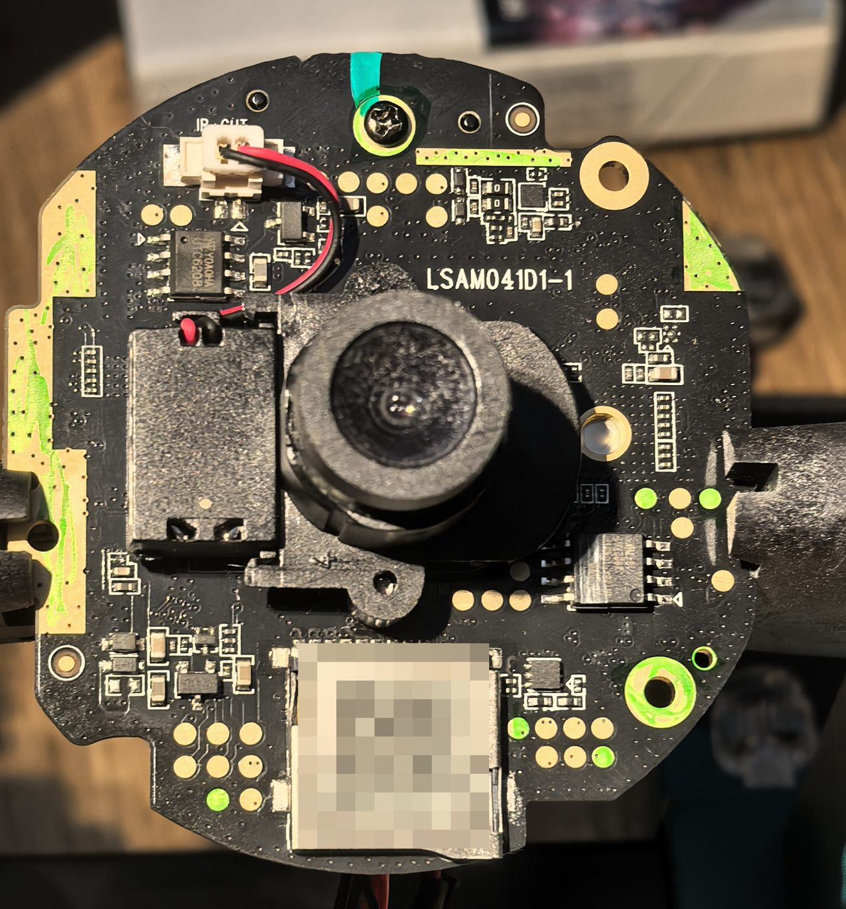
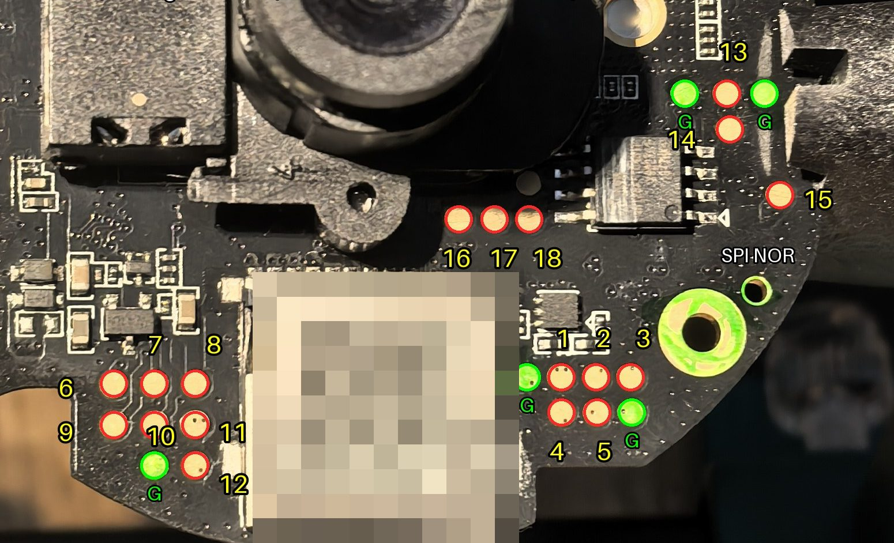
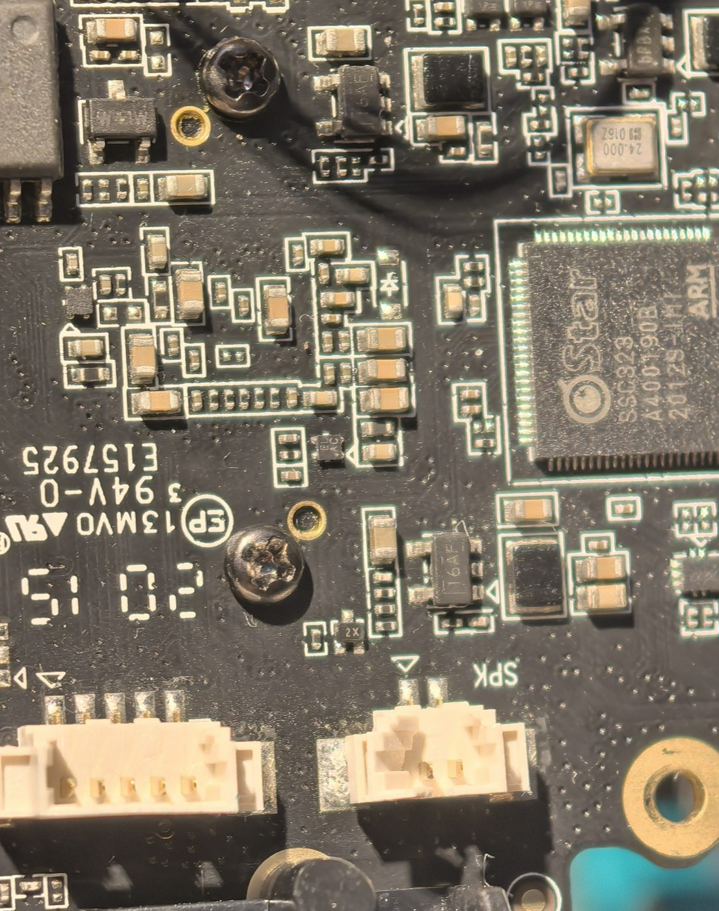
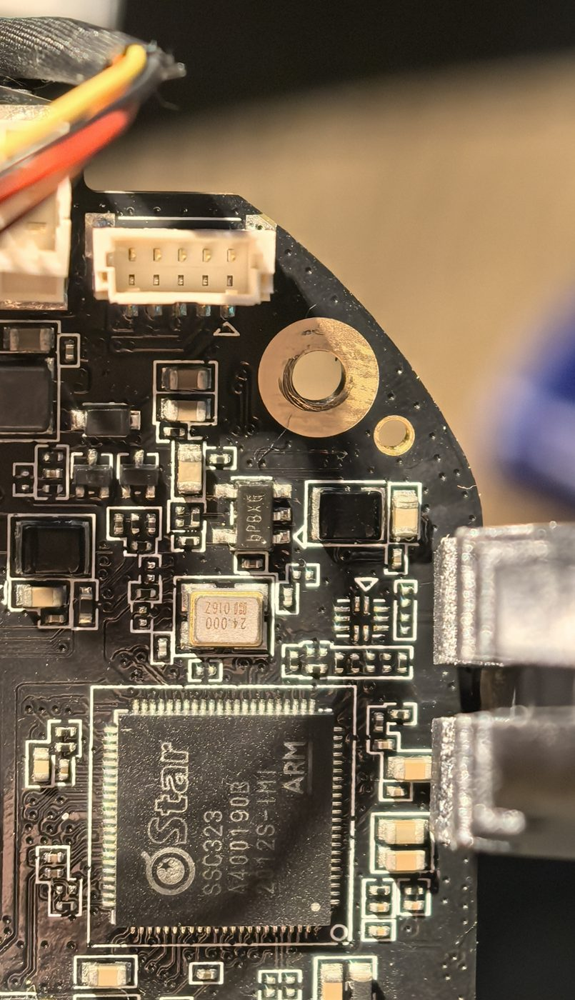
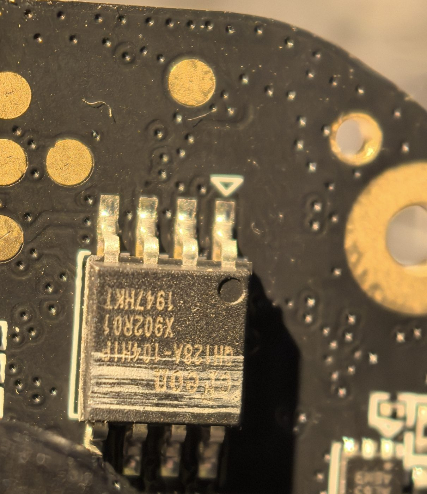
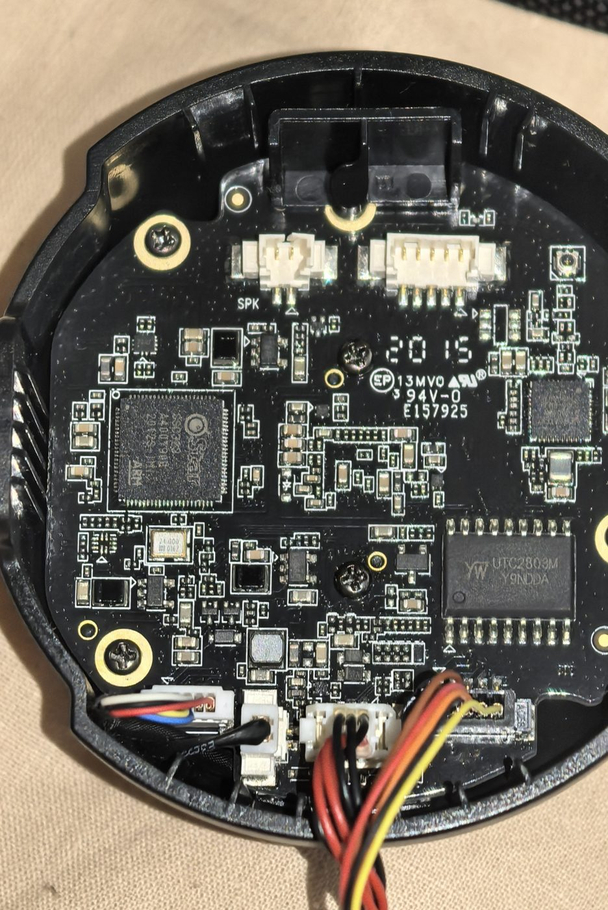

# Xiaomi Mi 360 (MJSXJ05CM) без облака: OpenIPC с SD-карты

<p align="center"></p>

## Что это в двух словах

Камера Xiaomi Mi Home Security Camera 360° 1080p (MJSXJ05CM, внутри `chuangmi.camera.ipc019`) работает
только через китайское облако и приложение Mi Home. Здесь она превращается в обычную сетевую камеру:
RTSP-поток, ONVIF, поворот, ночной режим, микрофон, динамик и запись на карту — всё в своей локальной сети,
без облака и без чужих серверов.

Главная фишка: **во флеш-память камеры не пишется ни байта прошивки.** Открытая прошивка [OpenIPC](https://openipc.org)
лежит на SD-карте. Родной загрузчик Xiaomi грузит её оттуда. Вынул карту — включил — снова обычная Xiaomi.

Проект живой, прошивка на моей камере работает прямо сейчас. Что готово, а что нет — [ниже](#где-мы-сейчас).

## Как это работает

1. **UART.** На плате есть две контактные площадки (13 и 14 на фото ниже). Через них камера при загрузке
   пишет в консоль всё, что с ней происходит, и туда же можно печатать команды. Подключаем к Raspberry Pi
   (или к любому USB-UART на 3.3 В), нажимаем Enter в первые секунды — и загрузчик U-Boot ждёт команд.
2. **Копия памяти.** Прежде чем что-то менять, загрузчик по кусочкам читает всю 16-мегабайтную SPI-флешку
   в консоль. Три прохода по два часа, все три копии совпали байт в байт. Это страховка и путь назад.
3. **OpenIPC на карте.** Берём ядро и систему из профиля `ssc325_lite_chuangmi-ipc017` проекта
   [OpenIPC/builder](https://github.com/OpenIPC/builder) (почти та же камера: процессор SigmaStar SSC323/SSC325,
   тот же Wi-Fi). Собираем свой образ карты: FAT-раздел с ядром и скриптами, squashfs с системой, большой
   раздел под записи. Родной стартовый скрипт OpenIPC не используем: он лезет писать во флеш.
4. **Одна строка в загрузчике.** В блоке переменных U-Boot (4 КБ в NOR) команда загрузки меняется на
   «сначала попробуй карту, если её нет — грузи как раньше». До шага 6 это единственная запись во флеш,
   и она обратимая: без карты камера грузит стоковую систему. Шаг 6 (по желанию) кладёт OpenIPC и в NOR.
5. **Периферия.** Моторы, ИК-фильтр, подсветка, микрофон и динамик подняты своими скриптами по картам
   GPIO, вытащенным из стоковой прошивки. Видео раздаёт majestic (штатный стример OpenIPC).

Подробно, на пальцах и с граблями — в посте [«как мы взломали камеру»](docs/post-2026-09-28-kak-my-vzlomali-kameru.md).
Технические решения с обоснованиями — в [DECISIONS.md](DECISIONS.md), состояние железа и раскладка флеша — в [STATUS.md](STATUS.md).

## Фото платы

Площадки для UART: **13 — TX камеры, 14 — RX камеры**, зелёные — земля. Все 18 промерены, остальные не нужны.

<p align="center"></p>

| | |
|---|---|
|  |  |
|  |  |

Плата LSAM041D1-1, процессор SigmaStar SSC323, NOR-флеш 16 МБ, Wi-Fi 2.4 ГГц, драйверы моторов UTC2803M/UTC6208.

## Как развернуть себе

Честно: сейчас это не «скачал образ, залил, работает». Нужен паяльник, UART и час-другой внимания.
Проверено на одной камере: плата LSAM041D1-1, стоковая прошивка 4.3.9_0445. На другой ревизии смещения
во флеше могут отличаться — сверяйте со своим дампом.

**Что нужно:** камера, SD-карта (проверена на 32 ГБ), Raspberry Pi или USB-UART на 3.3 В, резистор 1 кОм,
Linux с `sfdisk`, `mkfs.vfat`, `mksquashfs`, `python3`.

1. **Разберите камеру и припаяйте UART.** Земля → земля, площадка 13 (TX камеры) → RX адаптера,
   площадка 14 (RX камеры) → TX адаптера **через 1 кОм**. Только 3.3 В, камеру питайте штатным кабелем,
   никогда от адаптера. Подробности и пошаговая методика — [uart/README.md](uart/README.md).
2. **Снимите свой дамп флеша** (только чтение, ~2 часа): `python3 uart/dump.py 1`, потом `2` и `3` и
   сравните `sha256sum`. Без совпадающих копий дальше не идите — это ваш единственный путь назад.
3. **Соберите образ карты.** Скачайте `ssc325_lite_chuangmi-ipc017-nor.tgz` из релизов
   [OpenIPC/builder](https://github.com/OpenIPC/builder/releases) в `firmware/openipc-ipc017-20260926/`,
   распакуйте `uImage.ssc325` и `rootfs.squashfs.ssc325`. Создайте свои секреты (в репо их нет):
   `p4/secret/wpa.conf` (ваша сеть 2.4 ГГц, формат wpa_supplicant) и `p4/secret/shadow4` (строка root
   из `/etc/shadow` с вашим паролем). Затем:
   ```bash
   cd firmware/openipc-ipc017-20260926
   ./make-sd8.sh                       # → sd-stage8.img
   sudo dd if=sd-stage8.img of=/dev/sdX bs=4M conv=fsync status=progress
   sudo mount /dev/sdX1 /mnt && sudo cp p4/{autorun,cam-up,ptz,demo}.sh /mnt/ && sudo umount /mnt
   ```
4. **Проверьте загрузку с карты из RAM, ничего не записывая.** Вставьте карту, прервите U-Boot по UART и
   вручную: `dcache off; fatload mmc 0:1 0x22000000 uImage.ssc325; setenv bootargs ...; bootm 0x22000000`
   (точные строки — в [uboot/STOP-env.md](uboot/STOP-env.md)). Камера должна подняться в OpenIPC, появиться в
   Wi-Fi и отвечать по SSH (`python3 uart/camssh.py "uptime"`). Пока этот шаг не проходит стабильно — во флеш
   не пишите.
5. **Пропишите загрузку с карты в U-Boot** (единственная запись во флеш, 4 КБ блок переменных).
   Соберите блок: `python3 uboot/mkenv.py uboot/env-new.bin`, положите его на карту: `tools/p1-put.sh uboot/env-new.bin`.
   Запись делает этап `nor-env-write` в [uart/stage.py](uart/stage.py): перед стиранием он сверяет CRC
   старого блока со своим дампом, после записи — CRC нового, при любом расхождении останавливается.
   Сначала прочитайте [uboot/STOP-env.md](uboot/STOP-env.md) целиком.

Откат на любом шаге до шага 6: вынуть карту. Загрузчик не найдёт её и загрузит стоковую Xiaomi из NOR.
Если испортить блок переменных, U-Boot возьмёт дефолтные — камера остаётся живой и лечится по UART.

## Два режима: карта и NOR

После шага 5 загрузчик делает `run sdboot; run norboot`: есть `uImage.ssc325` на первом разделе карты — грузится
карта, нет — грузится то, что лежит в NOR. С 09.10 там OpenIPC (шаг 6), и камера
работает **и без карты** (записи при этом некуда — только с картой на p4); с картой в NOR-режиме карта — только данные (p1 autorun, p4 записи). Выбор режима — без записи во флеш,
переименованием файла на карте:

```bash
tools/boot-mode.sh status   # откуда загружена сейчас (mjsxj05cm-sd / mjsxj05cm-nor) и что будет при следующей загрузке
tools/boot-mode.sh nor      # следующая загрузка — из NOR   (uImage.ssc325 → uImage.ssc325.off)
tools/boot-mode.sh sd       # следующая загрузка — с карты  (обратно)
python3 uart/camssh.py "sync; reboot -f"
```

6. **OpenIPC в NOR** (три области: rootfs `0x250000`, ядро `0x50000`, env `0x4F000`; U-Boot, DATA, config, factory не
   трогаются). Сборка и запись автоматизированы, запись — тем же `stage.py` с проверкой CRC до стирания и после записи:
   ```bash
   cd firmware/openipc-ipc017-20260926 && ./make-rootfs-nor.sh && cd ../..   # rootfs как на карте + /opt/p1 для работы без карты
   python3 uboot/mkenv.py uboot/env-new-v5.bin --nor=openipc                  # env v5: norargs → root=/dev/mtdblock2, init=/init4.sh
   tools/p1-put.sh firmware/openipc-ipc017-20260926/{rootfs-nor.pad.bin,kernel.pad.bin} uboot/env-new-v5.bin   # на карту (http+wget)
   python3 uart/stage.py --dry-run nor-openipc-check                           # репетиция: гейты и файлы, без записи
   NOR_WRITE=yes STAGE_WAIT=86400 nohup python3 uart/stage.py nor-openipc-write > /dev/null 2>&1 &   # сама запись, ~5 мин после reboot камеры
   ```
   Порядок записи rootfs → ядро → env: при обрыве на любом шаге env ещё старый, и камера как прежде грузит карту.
   Сначала прочитайте [uboot/STOP-nor.md](uboot/STOP-nor.md) целиком — там таблица CRC, репетиции и что делать при отказе.

Откат на сток после шага 6: `nor-stock-restore` в `stage.py` — те же шаги с `mtd-kernel.bin`, `mtd-rootfs.bin` и
`env-old.bin` из вашего дампа (шаг 2) на карте. Вынутая карта после шага 6 даёт OpenIPC из NOR, а не сток.

После загрузки камера отдаёт:

- RTSP: `rtsp://admin:<пароль>@<ip>:554/stream=0` (1920×1080) и `/stream=1` (704×576);
- ONVIF на порту 80, SSH на 22 (root, ваш пароль);
- записи на четвёртом разделе карты по 20 минут, старые удаляются сами;
- поворот: `sh /tmp/ptz.sh left|right|up|down|init`.

Frigate и Home Assistant берут поток напрямую по RTSP/ONVIF; заготовки конфигов — в `tools/` и
[research/local-integration.md](research/local-integration.md).

## Где мы сейчас

Работает на моей камере:

- загрузка OpenIPC с карты без UART и без облака, автостарт за ~25 секунд;
- SSH с своим паролем, лишних портов нет (22, 80, 554);
- видео 1080p и 704×576 по RTSP, ONVIF, картинка в Home Assistant и Frigate;
- поворот в обе оси, ИК-фильтр и подсветка, микрофон, динамик;
- запись на карту с автоочисткой, NTP, аппаратный watchdog, системный лог на карте;
- стабильность: с включённым watchdog камера отработала два прогона — ~2 суток и ~28 часов — без единого зависания, оба раза остановка внешняя (перезагрузка сети, потом я полез в провода);
- надзор без человека: cron на Pi каждые 10 минут проверяет камеру и пишет в Telegram при смене состояния, UART-консоль пишется в файл сама (`tools/health/`).

Ещё не готово:

- детектор движения на самой камере: в Lite-сборке majestic его нет, движение считает Frigate;
- калибровка концевых положений поворота (моторы крутятся, «домой» пока по счёту шагов);
- собрать камеру обратно в корпус (провода UART ещё припаяны; сборка — на днях).

Формальный чеклист приёмки — [FULL-CONTROL-ACCEPTANCE.md](FULL-CONTROL-ACCEPTANCE.md).

## Что будет в итоге

Камера, которая после включения сама поднимается в OpenIPC, живёт неделями, отдаёт видео и события в
Home Assistant и Frigate, пишет на карту и ни разу не ходит в интернет. Плюс воспроизводимая инструкция:
«вот образ, вот три команды для UART, вот как вернуть как было».

## Что в репозитории

| Каталог | Что там |
|---|---|
| `uart/` | скрипты для консоли камеры: захват лога, дамп флеша, SSH, этапы репетиций и записи env |
| `uboot/` | сборка блока переменных U-Boot (`mkenv.py`), STOP-инструкции перед записями во флеш: env (`STOP-env.md`) и OpenIPC в NOR (`STOP-nor.md`) |
| `firmware/openipc-ipc017-20260926/` | сборка образа карты, стартовые скрипты (`p4/`), контрольные суммы |
| `firmware/` | разбор стоковых прошивок Xiaomi: раскладка, binwalk, strings |
| `research/` | источники и чужие наработки, карты GPIO, заметки по PTZ, звуку, событиям, интеграции |
| `tools/` | загрузка файлов на карту (`p1-put.sh`), переключение карта/NOR (`boot-mode.sh`), ONVIF-опрос, `tools/health/` — автономный надзор (cron + UART-логгер) |
| `docs/` | пост с историей, фото платы, план раздела под записи, рабочие заметки |
| `STATUS.md`, `DECISIONS.md` | текущее состояние железа/прошивки и журнал решений |

Дампы флеша, образы карты, пароли, Wi-Fi и MAC в репозиторий не входят и не войдут.

## Спасибо

Проект стоит на чужих плечах: [OpenIPC](https://github.com/OpenIPC) и профиль ipc017 от
[Jamp](https://github.com/Jamp/chuangmi-ipc017-openipc), разборы и утилиты
[khmyznikov](https://github.com/khmyznikov/mjsxj05cm-firmware-downgrade),
[cmiguelcabral](https://github.com/cmiguelcabral/mjsxj05cm-hacks), [zry98](https://github.com/zry98/MJSXJ05CM-hacks),
[tsunglung](https://github.com/tsunglung/xiaomi-360-hacks), grablya95, [Sungur Labs](https://sungurlabs.github.io),
[go2rtc](https://github.com/AlexxIT/go2rtc) и форум 4PDA. Полный список с оценкой каждого источника —
[research/sources.md](research/sources.md).

Большую часть скриптов и разбора сделал Claude (Anthropic) под моим присмотром; паял, мерил и нажимал кнопки я.

## Дисклеймер

Вы делаете это со своей камерой на свой риск. Запись во флеш при ошибке превращает камеру в кирпич,
а программатора с прищепкой у меня нет и вернуть её мне не удастся. Никаких гарантий.

## Лицензия

[MIT](LICENSE). Чужие материалы в `research/` — под лицензиями их авторов, ссылки в `research/sources.md`.
